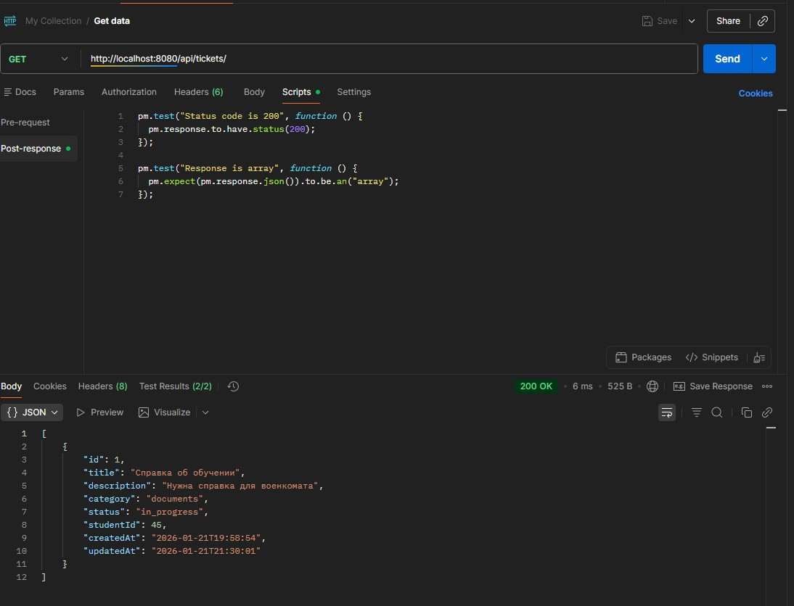
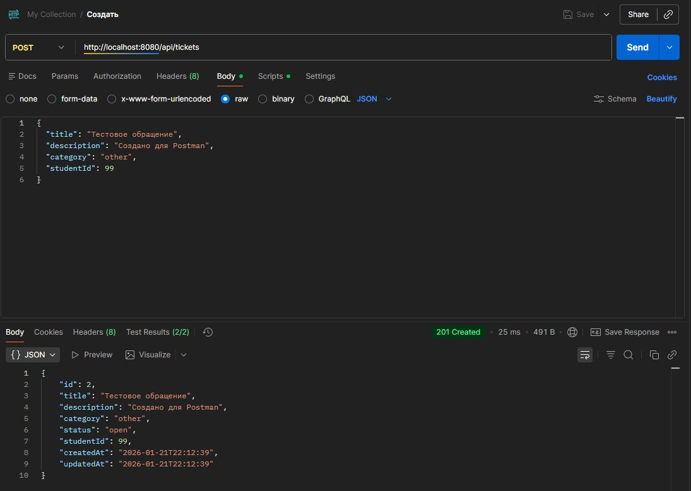
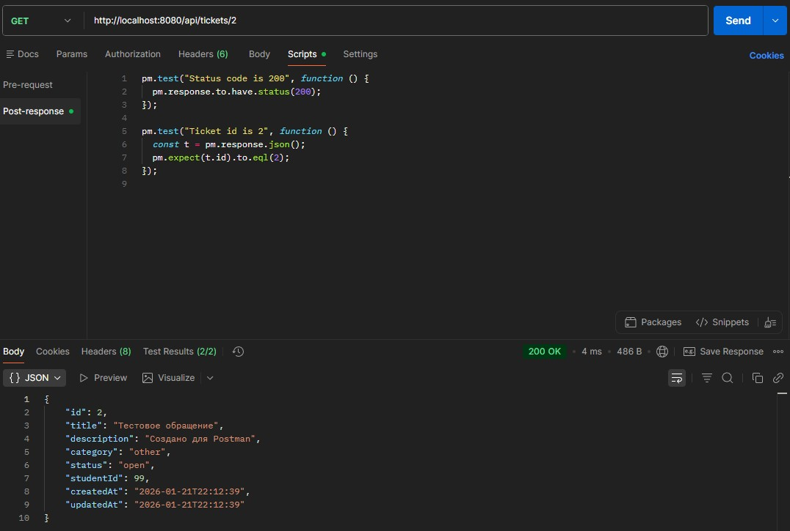
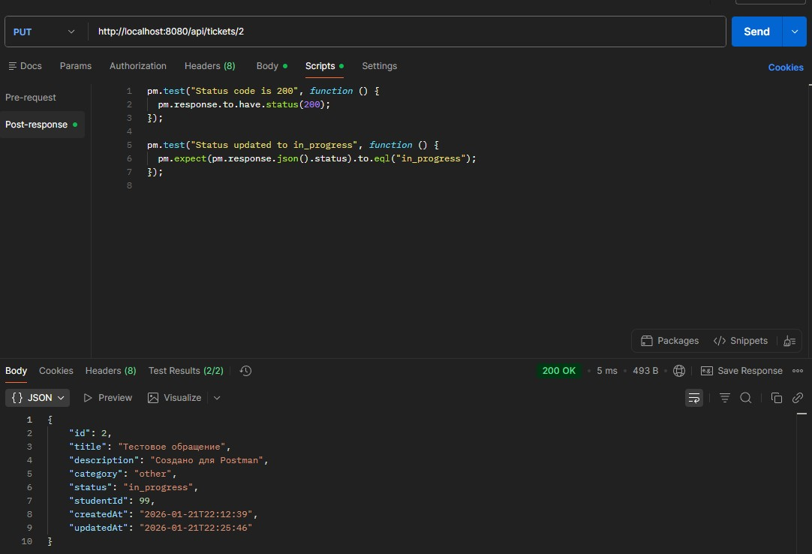
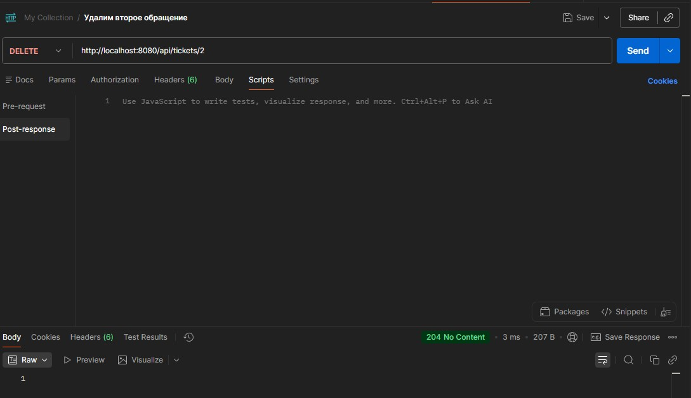

# Лабораторная работа №4  
## Проектирование REST API 
## Цель работы
Получить опыт проектирования программного интерфейса.

---

## Принятые проектные решения
- Архитектурный стиль: выбран REST-подход для предоставления доступа к ресурсам системы через HTTP. Ресурсы адресуются через URI (например, /api/tickets, /api/tickets/{id}), что обеспечивает единообразие и предсказуемость интерфейса.
- HTTP-методы по назначению: используются стандартные методы: GET для получения данных, POST для создания, PUT для обновления, DELETE для удаления/архивации.
- Единый префикс API: все маршруты имеют общий префикс /api, что позволяет отделить API от возможного фронтенда и иных маршрутов сервера.
- Формат обмена данными: все тела запросов и ответов передаются в формате JSON (application/json), что упрощает интеграцию с веб-клиентом и тестирование.
- Идентификация ресурсов: для обращения к конкретному ресурсу используется path-параметр {id} (например, /api/tickets/2).
- Валидация входных данных: на стороне сервера проверяются обязательные поля и допустимые значения перечислений (например, статус обращения). При ошибке валидации возвращается код 422.
- Единый формат ошибок: ошибки возвращаются унифицированно (тип ошибки, сообщение, детали), что облегчает обработку на клиенте и делает поведение API предсказуемым.
- Логическое удаление: для сохранения истории обращений допускается мягкое удаление (архивация), когда обращение переводится в статус archived, что полезно для аудита и последующей аналитики.

---
 
## Описание эндпоинтов 

### ('/api/tickets') — получить список обращений
* **Метод:** GET
* **Описание:** Возвращает все обращения внезависимотсти от статуса.
* **Параметры запроса:**
    * `status` (string): Фильтрация по статусу обращения.
    * `studentId` (number): Идентификатор студента.
    * `category` (string): Категория обращения.
    * `limit` (number): Максимальное количество элементов в ответе.
    * `offset` (number): Смещение для постраничного вывода.
* **Ответ:**
    * 200 (OK): JSON-массив всех обращений.

### ('/api/tickets/{id}') — получить обращение по идентификатору
* **Метод:** GET
* **Описание:** Возвращает обращение по идентификатору.
* **Параметры запроса:**
    * `id` (number): Уникальный идентификатор обращения.
* **Ответ:**
    * 200 (OK): Обращение найдено.
    * 404 (Not Found): обращение отсутствует.

### ('/api/tickets/{id}') — обновить обращение
* **Метод:** PUT
* **Описание:** Обновляет тикет по идентификатору.
* **Параметры запроса:**
    - (Path Parameters)
    * `id` (number): Уникальный идентификатор обращения.
    - (Body Parameters)
    * `status` (string): Новый статус обращения.
    * `title` (string): Обновлённый заголовок.
    * `description` (string): Обновлённое описание.
    * `category` (string): Новая категория.
* **Ответ:**
    * 200 (OK): Данные обновлены.
    * 404 (Not Found): Обращение не найдено.
    * 422 (Unprocessable Entity): Некорректные данные.

### ('/api/tickets') — создать новое обращение
* **Метод:** POST
* **Описание:** Создает новое обращение.
* **Параметры запроса:** 
    * `studentId` (number): Идентификатор студента.
    * `title` (string): Краткий заголовок.
    * `description` (string): Подробное описание.
    * `category` (string): Категория обращения
* **Ответ:**
    * 201 (Created): Обращение создано.
    * 422 (Unprocessable Entity): Ошибка валидации.

### ('/api/tickets') — удалить обращение
* **Метод:** DELETE
* **Описание:** Выполняет логическое удаление обращенияю.
* **Параметры запроса:** 
    * `id` (number): Уникальный идентификатор обращения.
* **Ответ:**
    * 204 (No Content): Успешно удалено.
    * 422 (Unprocessable Entity): Обращение не найдено.

### ('/api/students/{studentId}/tickets') — обращения конкретного студента
* **Метод:** GET
* **Описание:** Возвращает список всех обращений, созданных указанным студентом.
* **Параметры запроса:** 
    * `studentId` (number): Идентификатор студента.
* **Ответ:**
    * 200 (OK): JSON-массив обращений студента.
---

## Тестирование в Postman

### GET ('/api/tickets') - Получить все обращения
- Request - http://localhost:8080/api/tickets
- Post-response - pm.test("Status code is 200", function () {
                    pm.response.to.have.status(200);
                });             
                  pm.test("Response is array", function () {
                    pm.expect(pm.response.json()).to.be.an("array");
                });

### POST ('/api/tickets') - Создать обращение
* **Body** 
{
  "title": "Тестовое обращение",
  "description": "Создано для Postman",
  "category": "other",
  "studentId": 99
}
- Request - http://localhost:8080/api/tickets
- Post-response - pm.test("Status code is 201", function () {
                    pm.response.to.have.status(201);
                });            
                  pm.test("Response has id and status=open", function () {
                    const t = pm.response.json();
                    pm.expect(t).to.have.property("id");
                    pm.expect(t).to.have.property("status", "open");
                    pm.environment.set("ticketId", t.id);
                });

### GET ('/api/tickets/{id}') - Получим последнее созданное по id
- Request - http://localhost:8080/api/tickets/{{id}}
- Post-response - pm.test("Status code is 200", function () {
                    pm.response.to.have.status(200);
                });
                pm.test("Ticket id matches ticketId", function () {
                    const t = pm.response.json();
                    pm.expect(t.id).to.eql(Number(pm.environment.get("ticketId")));
                });

### PUT ('/api/tickets/{id}') - Обновить Статус
* **Body** 
{ "status": "in_progress" }
- Request - http://localhost:8080/api/tickets/{{Id}}
- Post-response - pm.test("Status code is 200", function () {
                    pm.response.to.have.status(200);
                });
                pm.test("Status updated to in_progress", function () {
                    pm.expect(pm.response.json().status).to.eql("in_progress");
                });

### GET ('/api/students/{studentId}/tickets') - Получим обращение по id студенты
- Request - http://localhost:8080/api/students/99/tickets
- Post-response - pm.test("Status code is 200", function () {
                    pm.response.to.have.status(200);
                });
                pm.test("Response is array", function () {
                    pm.expect(pm.response.json()).to.be.an("array");
                });

### DELETE ('/api/tickets/{id}') - Удалим обращение по id
- Request - http://localhost:8080/api/tickets/{{Id}}
- Post-response - m.test("Status code is 204", function () {
                    pm.response.to.have.status(204);
                });
 
